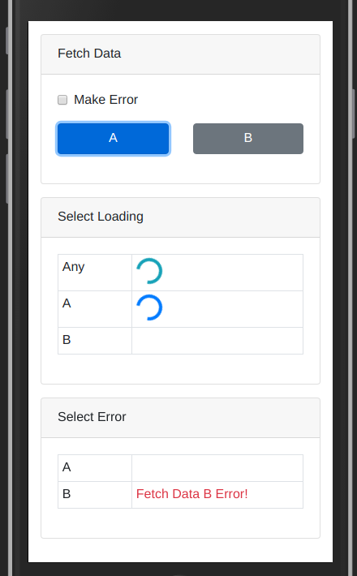

# Global Loading & Error State Demo

## Theory

Refer to my [blog](https://medium.com/@zzdjk6/implement-global-loading-and-error-state-with-redux-thunk-routine-and-typescript-b278f93e99fd)

## Overview

The demo is very simple.

There are 3 buttons in the first card to simulate loading data from different sources.

> Click A (This is loading A)
> Click B (This is loading B)
> Click C (And this is loading C)

While data is loading, spinners will show up in the second card.
The text in the left column indicates the condition of diplaying the spinner next to it.

For example, the first spinner will always show up whatever data we are loading.

> Click A, B, C one-by-one

In contrast, the second spinner will only show up when we are loading A or B, not loading C.

> Click A, B, C one-by-one

We can tick the checkbox to generate errors when loading data.

> Click checkbox

And the errors will show up in the 3rd card for corresponding source.

> Click A, B, C one-by-one

By the way, there is no conflicts among loading data from different sources because the loading and error states are stored per routine.
So it is fine to start loading them at the same time.

> Click A, B, C at the same time / quickly

We can have a look at the structure of states in redux-dev-tools.

> Click the last action, and expend the States > Raw
> Select loading state (This is the loading state)
> Select error state (And this is the error state)

That's it.
