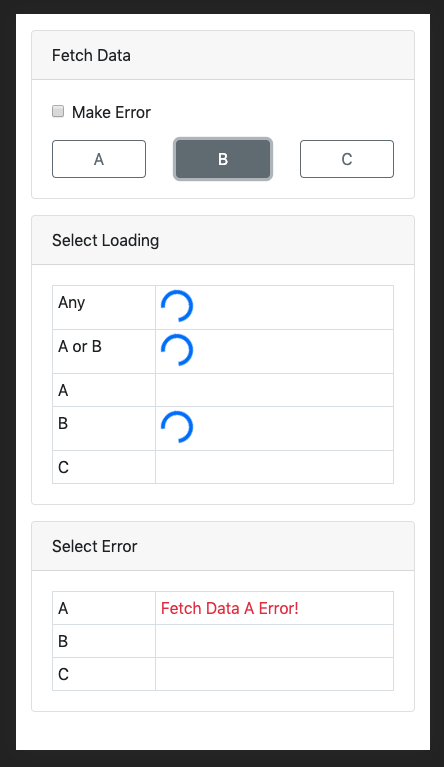

# Global Loading & Error State Demo

## Theory

Refer to my [blog](https://medium.com/@zzdjk6/implement-global-loading-and-error-state-with-redux-thunk-routine-and-typescript-b278f93e99fd)

## Overview

This is a very simple demo.

There are 3 buttons in the first card to simulate loading data from different sources.

While data is loading, spinners will show up in the second card.
The text in the left column indicates the condition to diplay the spinner next to it.
For example, the first spinner will always show up whatever data we are loading.
But the second spinner will only show up when we are loading A or B, not loading C.

We can tick the checkbox so generate errors when loading data.
And the errors will show up in the 3rd card for corresponding source.

If we look at the redux dev tools, we can see that:
when receive "request" action, we set the loading flag to ture and error to null,
when receive "success" action, we set the loading flag to false,
when receive "failure" action, we set the loading flag to false and save the error.

That's it.
